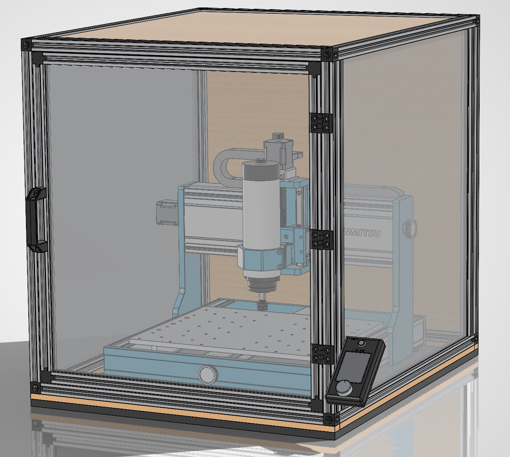
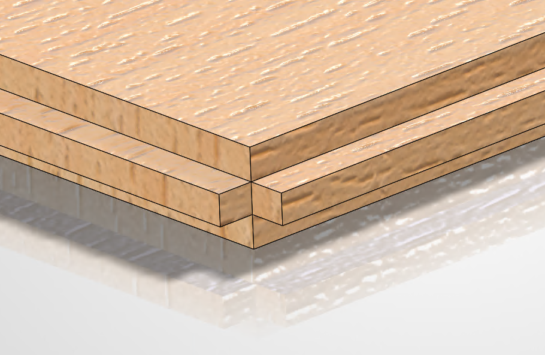
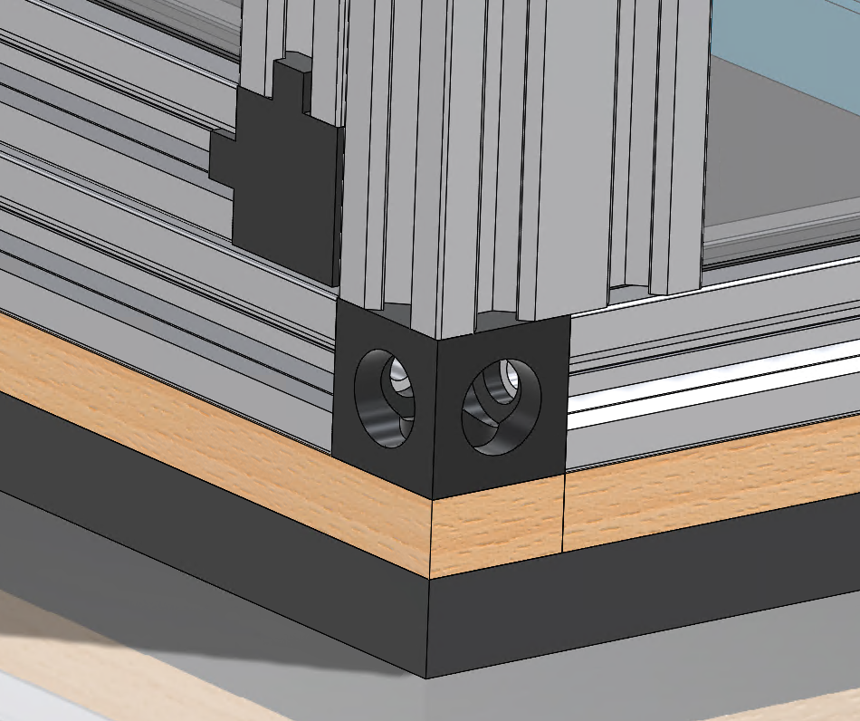
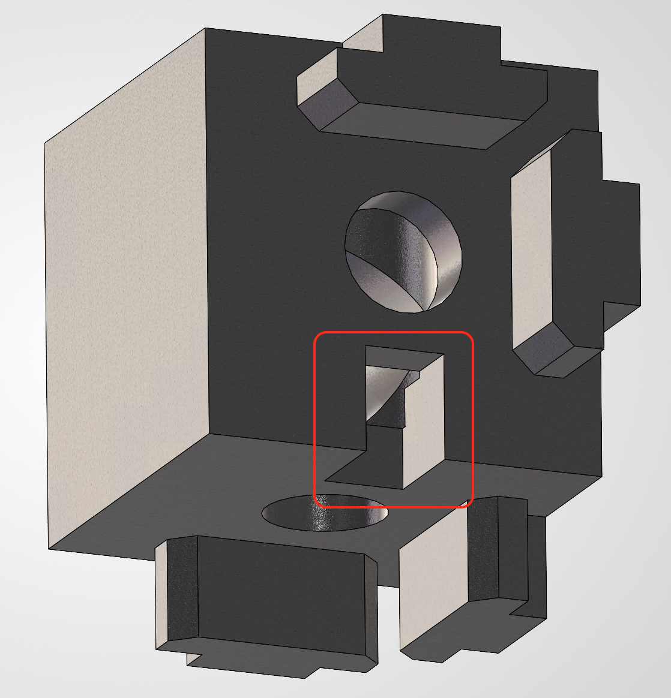
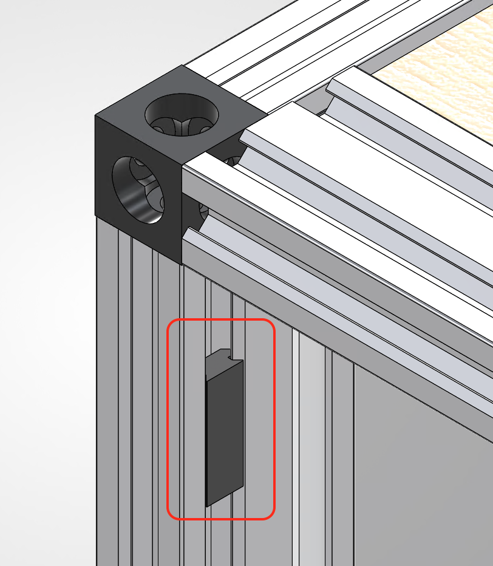
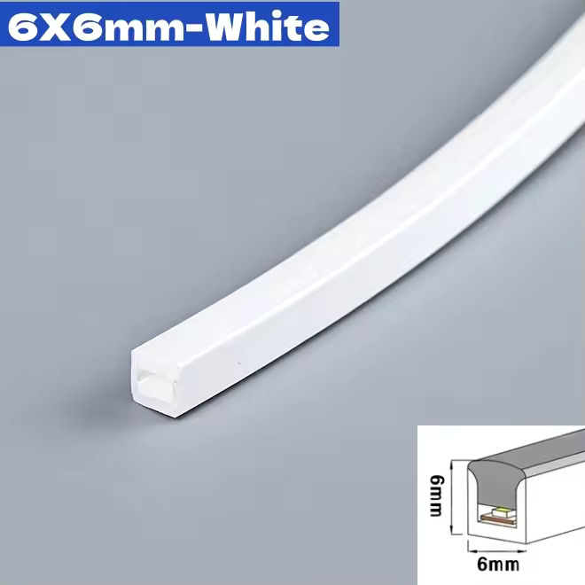
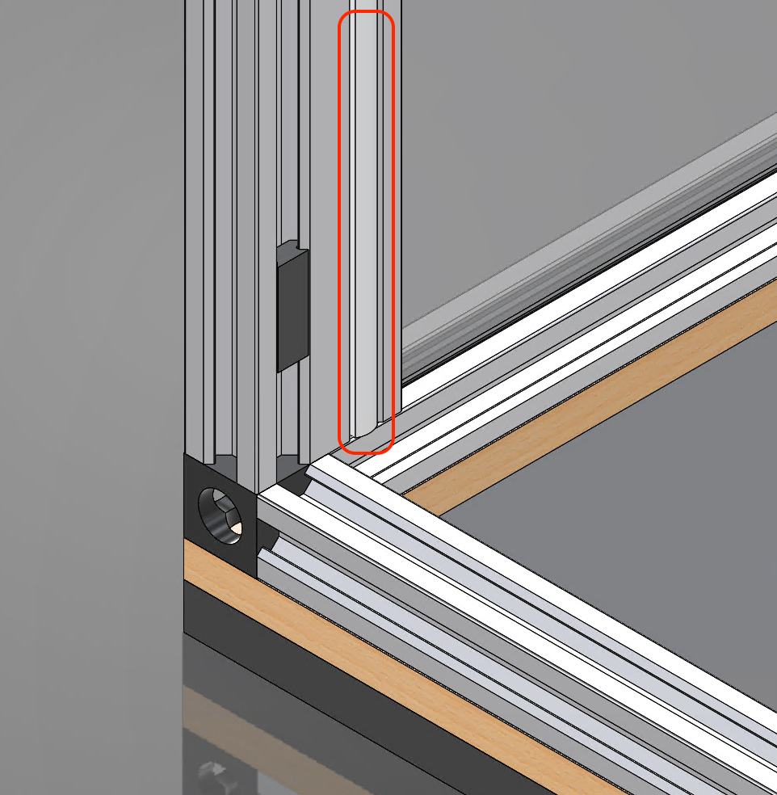

# Enclosure
This section contains information on building an enclosure for the CNC.

It is designed for the standard range of travel motions and with the standard stepper motors in place. If you modify any of these, you may have to make changes to the size of the enclosure. Although not tested, it has been designed to allow for the use of a 1.5Kw 65mm spindle.

The offline controller should be placed outside the enclosure and may be attached with M4 T-Nuts. The cables should be just long enough, but if they are not extensions may be found on AliExpress (search for JST PH and JST PHB extensions)

It is recommended to read through all of this information prior to commencing any work.

1 Genmitsu CAD model shown is from [Printables](https://www.printables.com/model/1285038-genmitsu-3030-prover-max)

## Bill of Materials (BOM)

### Purchased Parts
| Item | Quantity | Supplier (UK) | Notes |
| - | - | - | - |
| **2020** Aluminium Extrusion (**478mm**) | 2 | [Ooznest](https://ooznest.co.uk/) | Tapped both ends (Door top/bottom)|
| **2020** Aluminium Extrusion (**518mm**) | 2 | [Ooznest](https://ooznest.co.uk/) | Tapped both ends  (Door sides) |
| **2020** Aluminium Extrusion (**520mm**) | 2 | [Ooznest](https://ooznest.co.uk/) | Tapped both ends (Front/Rear base) |
| **2020** Aluminium Extrusion (**620mm**) | 4 | [Ooznest](https://ooznest.co.uk/) | Tapped both ends (Sides) |
| **2040** Aluminium Extrusion (**520mm**) | 2 | [Ooznest](https://ooznest.co.uk/) | Tapped both ends (Front/Rear top) |
| **2040** Aluminium Extrusion (**560mm**) | 4 | [Ooznest](https://ooznest.co.uk/) | Tapped both ends (Front/Rear sides) |
| 20 Series T/V-Slot Panel Sealing Strip | 12m | [Ooznest](https://ooznest.co.uk/) | Lubrication was required even with 3mm panel. Strips are a hard plastic and not rubber. Alternatives may be better |
| 2020 Door Handle | 1 | [Ooznest](https://ooznest.co.uk/) | |
| 2020 Hinge | 3 | [Ooznest](https://ooznest.co.uk/) | |
| M4 T-Nut | 16 | [Ooznest](https://ooznest.co.uk/) | |
| M5 T-Nut | 14 | [Ooznest](https://ooznest.co.uk/) | |
| M4x12 CSK Screw | 8 | [Ooznest](https://ooznest.co.uk/) | Length depends on the stripwood thickness|
| M5x8 Low Profile Screw | 12 | [Ooznest](https://ooznest.co.uk/) | Door Hinges |
| M5x14 CSK Screw | 8 | [Ooznest](https://ooznest.co.uk/) | Only required if using the 3D printed corners. |
| 2020 Corner Cube | 12/8 | [Amazon](https://www.amazon.co.uk/dp/B08Z3GRQCW/?coliid=I1LXS3MRZ1L2MV&colid=A492FOWYBVRB&th=1) | UK use 5mm screws, other countries use 6mm. This kit contained both. Only 8 required if using the 3D printed corners. |
| Polycarbonate Sheet (**530mm x 570mm**) | 2 | [SimplyPlastics](https://www.simplyplastics.com/catalog/sheet/polycarbonate-sheet/clear-polycarbonate-sheet/c-24/c-90/p-256) | Sides |
| Polycarbonate Sheet (**488mm x 528mm**) | 1 | [SimplyPlastics](https://www.simplyplastics.com/catalog/sheet/polycarbonate-sheet/clear-polycarbonate-sheet/c-24/c-90/p-256) | Door |
| Plywood/MDF Top (**530mm x 590mm**)| 1 | Local builders merchant, Wickes, B&Q etc. | See [Assembly Notes](#wood-panels) |
| Plywood/MDF Rear (**530mm x 570mm**)| 1 | Local builders merchant, Wickes, B&Q etc. | See [Assembly Notes](#wood-panels) |
| 20mm wide stripwood Front/Rear **560mm** | 2 | Local builders merchant, Wickes, B&Q etc. | Can use offcuts from the wood panels |
| 20mm wide stripwood Side **620mm** | 2 | Local builders merchant, Wickes, B&Q etc. | Can use offcuts from the side panels |
| Anti-Vibration Matting) | 1 | [Screwfix](https://www.screwfix.com/p/essentials-shock-absorbing-floor-mat-black-620mm-x-620mm-x-12mm/967KN) | Slightly undersized in the length, but the width offcuts may be attached with polyurethane adhesive.|
| 20mm x 4mm x 2mm thick N42 Neodymium Magnet - 1.9kg Pull | 8 | [First4Magnets](https://www.first4magnets.com/product/20-x-4-x-2mm-thick-n42-neodymium-magnet-19kg-pull-19305?variant=1151) | |
| 6mm x 6mm Flexible LED Strip | 3m | [AliExpress](https://www.aliexpress.com/item/1005007424507477.html) | |

### Optional 3D Printed Parts
| Item | Quantity | Link | Notes |
| - | - | - | - |
| 2020 2-Way Corner Cube | 4 | [3MF file](./3DPrintFiles/2020CornerCube2Way.3mf) | A normal cube may be used but you will have to notch the panel corners. |
| Magnet Holder | 4 | [3MF file](./3DPrintFiles/MagnetHolder.3mf) | The magnets could be directly glued in place. |

# Assembly Notes

## Wood Panels
A 'half sheet' (606 x 1220mm/2' x 4') cut carefully will be enough for both the rear and top panel as well as the base strips.

Depending on the thickness of the wood purchased  you may have to rabbet the edge to fit in the Aluminium extrusion or Panel Sealing Strip.

The corners on the rear panel will also have to be removed to fit around the corner cube

## Base Strips
Strips of wood are fitted around the base and are held in place by M4 CSK screws and T-Nuts. These are designed to allow notches to be easily cut for any wires coming in/out of the enclosure.

## Door
### Door Panel Corners
If you are not using the 3D printed corner cubes you will need to remove the corners of the door panel in the same way as the wood panels to fit around the corner cubes.

The [3D printed corner cubes](./3DPrintFiles/2020CornerCube2Way.3mf) have notches in them to avoid this modification

### Door Magnets
Magnets may be used to create a surprisingly good invisible door catch. Make sure to put the magnets in the correct orientation and align them opposite each other so they are attracted to each other when the door is closed. 

> [!TIP]
> Each [3D printed holder](./3DPrintFiles/MagnetHolder.3mf) is designed to have two magnets fitted, but the number may be adjusted to change the strength of the catch.

If you are concerned with the door being opened during operation and someone being injured, fit a lockable catch or a magnetic switch to trigger the [E-Stop](../estops/readme.md).

## LED Lighting
6mm x 6mm narrow flexible LED strips fit perfectly in the 6mm wide and deep channels of the 2040 extrusion at the front and rear of the enclosure.
Simply push fit them in one side, over the top and down the other side. 

Modify the extrusions as required to allow the wires to exit the enclosure.

> [!TIP]
> When wiring the LED strip, connect to the wiring point just beyond the first section of LEDs. This will allow the wires to bend more easily without breaking the solder joint. Silicone sealant may also be used to reenforce the joint.

> [!TIP]
> The LED strip can be run at less than 12v to extend the life of the LEDs while still providing enough illumination.