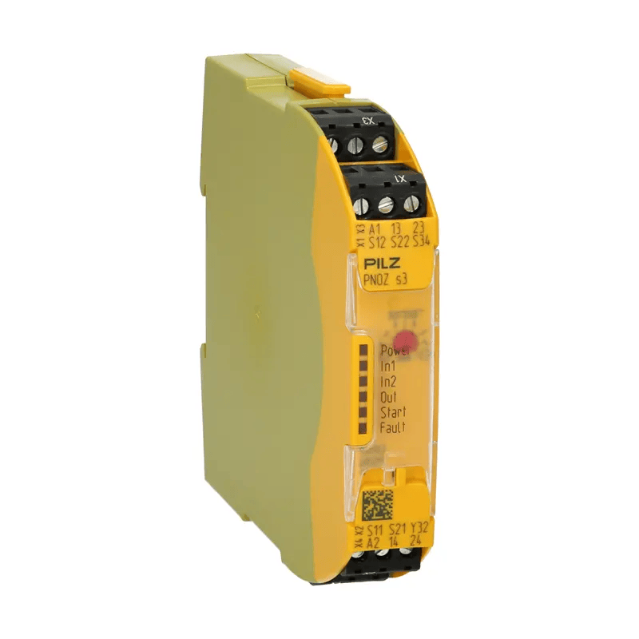

# E-Stops
This section contains information on stopping the machine in an emergency.

## Normally Closed or Normally Open?
In their most basic form, E-Stops are just switches, but switches can come in two forms, Normally Closed (NC) and Normally Open (NO). It's important to understand the difference between these when purchasing emergency stop switches as the wrong type will not directly work with the CNC controller. 

### Normally Closed (NC)
A Normally Closed (NC) switch maintains a closed circuit by default, allowing current to flow through it when it is in its normal, inactivated state. When it is pressed the switch opens and current can no longer flow. 

Generally, NC switches should be used for safety mechanisms, such as an *Emergency Stop*, as a damaged wire will inherently trigger the stop

### Normally Open (NO)
A Normally Open (NO) switch maintains an open circuit by default, preventing current flow through it when it is in its normal, inactivated state. When it is pressed the switch closes and current can flow. 

## Emergency Stop (E-Stop) - Overview
In the authors opinion, the emergency stop on the Genmitsu* has a few design flaws,

1. It relies on a NO switch
2. It is not independent of the controller
3. The E-Stop button is small and may not be easy to reach in a panic

The first becomes an issue if there is any fault in the wiring/switch as the fault itself will not trigger a fault condition. Which leads to only finding out about the fault when the E-Stop button is pressed and nothing happens...

The second is an issue if the controller itself can't respond to the E-Stop button press. Which could happen if the controller has crashed.

The first two issues may mitigate to some extent with external electronics and the third can be mitigated by either replacing the current E-Stop button or wiring in an additional button in parallel.

* To be fair to SainSmart, almost all of these desktop CNCs that are produced down to a low price have the same flaws.

### Converting from a NO to NC E-Stop
As shown in the [Probe](../probes/readme.md#tool-setter-and-a-3d-touch-probe) section, it is possible to convert a NO to a NC circuit. This solution is not 100% perfect, as a fault between the invertor circuit and the controller would still result in an unknown fault condition. However, it could help lower this risk and it does allow you to connect extra NC switches in the E-Stop circuit. Such as the one on a tool setter or an enclosure door switch.

Below is a simple circuit that may be used to convert a NO connection to a NC connection and has support for multiple inputs. If multiple inputs are not required, simply remove them or use a jumper to permanently short them.

To connect the circuit to the Genmitsu you will have to open up the offline controller, or the main controller, and connect to the E-Stop pins. Both use a standard JST PH connector and if soldering directly to the PCB it not an option splitter cables may be found on AliExpress/eBay

### Safety Relays

Safety relays are a large topic and there are many different types for many different situations and many ways of wiring them. Therefore, this guide is only intended to introduce them and their benefits. 

A safety relay is a special type of relay that contains electronics that monitor inputs to ensure they are working as expected and only allows equipment to be started when it is safe to do so. Should an E-Stop be pressed, or depending on the relay, a fault detected with the E-Stop or relay, then power will be automatically cut off to the externally controlled equipment completely independently of any other electronics.

New safety relays can be very expensive $100+, but they can often be picked up second-hand online for a fraction of the price. 