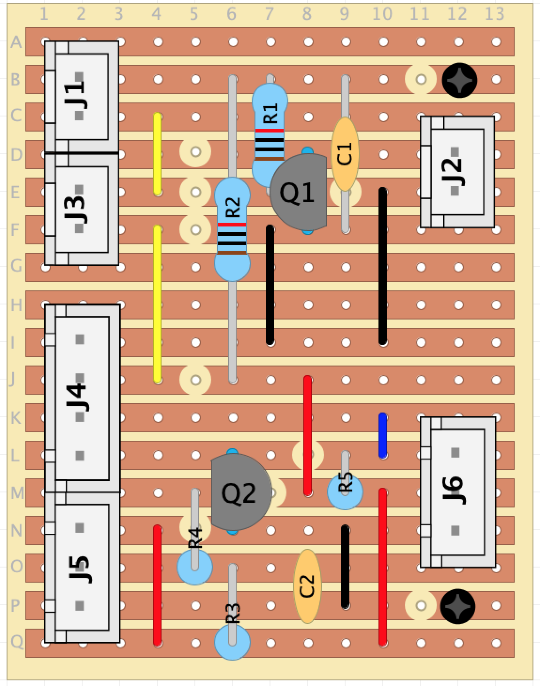

# Example Probe and E-Stop Circuit/PCB
By combining the two circuits discussed in the [probe](../probes/readme.md) and [e-stop](../estops/readme.md) information, it is possible to connect a NC tool setter (with end stop protection), a NO 3D Touch Probe and two external E-Stop switches to the Genmitsu controller via a Stripboard PCB

> [!CAUTION]
> This PCB has NOT been tested. Use at your own risk!

Designed using [DIYLC](https://github.com/bancika/diy-layout-creator/releases) and the layout may be found [here](./circuit/stripboardBJT.diy) 

A PDF of the full circuit may be found [here](./circuit/GenmitsuMicroPCBschematic.pdf) 

The above PCB uses JST PH connectors, but these could be swapped out for small terminal connectors if you do not have the tools to crimp the terminals.

> [!WARNING]
> Make sure to mirror the stripboard when drilling the holes to cut the traces. A mirrored version may be found [here](./images/stripboardBJTMirrored.png)

**Bill of Materials**
|    Item    |  Description   |     Value    |  Quantity  |
|     -      |        -       |     -        |      -     |
| Stripboard |        -       | 17V x 13H    |            |
| R1 -> R5   | Resistor       | 10K          | 5          |
| Q1, Q2     | NPN Transistor | BC3371 | 1          |
| J1 -> J3   | JST PH Header  | 2 Pin        | 4          |
| J5, J6     | JST PH Header  | 3 Pin        | 2          |
| J4         | JST PH Header  | 4 Pin        | 1          | 

1 Other BJT or MOSFET may also be suitable, e.g. 2N2222, BS170
