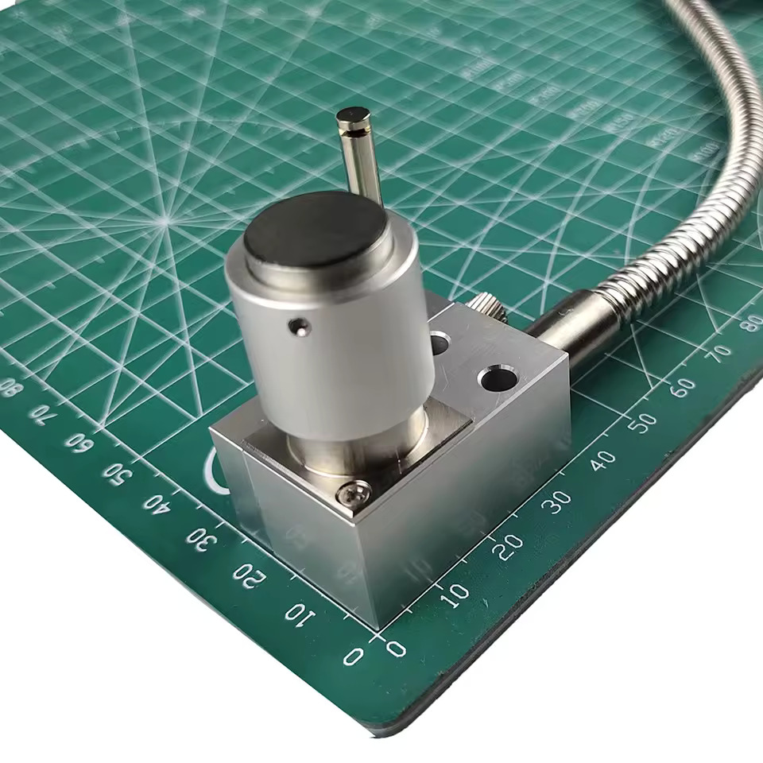
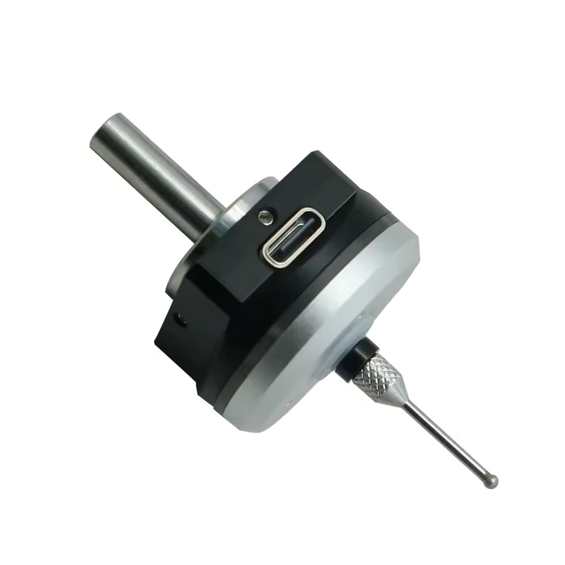
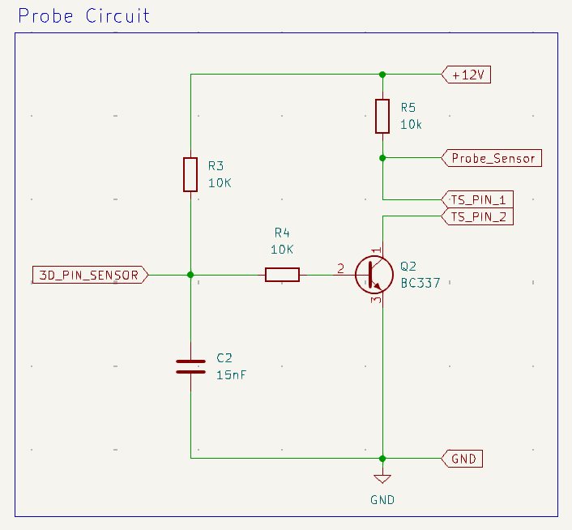
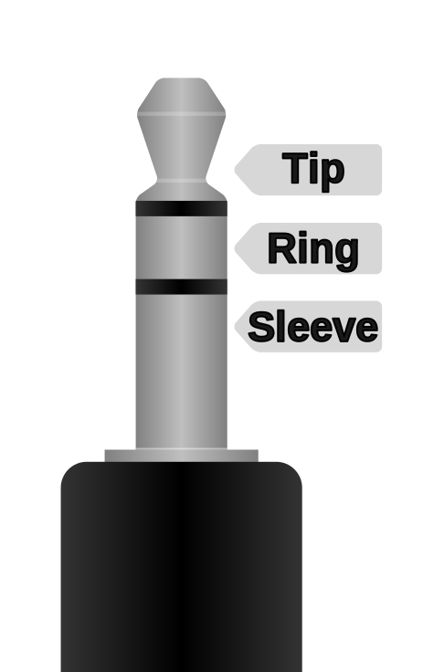

# Probes
This section contains information on Probes for setting the length of tools and for acurately identifying work coordinates.

## Normally Closed or Normally Open?
Probes are essentially just switches, but switches can come in two forms, Normally Closed (NC) and Normally Open (NO). It's important to understand the difference between these when purchasing probes as the wrong type will not directly work with the CNC controller. 

### Normally Closed (NC)
A Normally Closed (NC) switch maintains a closed circuit by default, allowing current to flow through it when it is in its normal, inactivated state. When it is pressed the switch opens and current can no longer flow. 

Generally, NC switches should be used for safety mechanisms, such as an *Emergency Stop*, as a damaged wire will inherently trigger the stop (more information may be found in the [Emergency Stop](../estops/readme.md) section)

### Normally Open (NO)
A Normally Open (NO) switch maintains an open circuit by default, preventing current flow through it when it is in its normal, inactivated state. When it is pressed the switch closes and current can flow. 

## Tool Setter

Generic NC tool setters that are used to determine the length of a tool in the spindle may be found on AliExpress for around $35. These often also have travel over limit protection that should be wired to an E-Stop to help prevent damage to a tool that is not detected for some reason.

If you connect this directly to the probe input on the Genmitsu you will have to reverse the input in the software using the `$6=1` command. This is because the standard probe expects a (NO) connection.

A typical pinout is shown below, but pinouts vary between manufacturers so always check them,

| Purpose | Wire |
| - | - |
| Probe Signal | Brown, Black |
| Over Limit Protection | Green, White |

## 3D Touch Probe

Generic NO 3D Touch Probes may be found on AliExpress for around $45. These are used to determine the work coordinates of the part to be machined.

NC versions are also available, but seem to be a lot harder to find and often cost more at around $75

If you connect this directly to the probe input on the Genmitsu it should work out of the box. 

## Tool Setter and a 3D Touch Probe
If you want to use both a Tool Setter and a 3D Touch Probe and have both wired at the same time, you may want to buy **NC** versions of both. Then you can just wire them in series, and everything will work as expected. 

However, this method does have the disadvantage of having to have the 3D Touch Probe permanently connected.

Things become a bit more complicated if you buy a NC Tool Setter and a **NO** 3D Touch Probe, but it is possible to get them to work together with a small circuit. 

This circuit works by inverting the NO 3D touch probe signal via an NPM transistor, effectively converting it to a NC signal. 

The *+12V*, *GND*, and *Probe_Sensor* are provided by the Genmitsu controller via the **2.5mm** jack. Alway check pinouts, but usually they are as follows,

| Pin | Wire | Function |
| - | - | - |
| Tip | White | Sensor Signal |
| Ring | Red | +12V Supply |
| Sleeve | Black | Ground |

