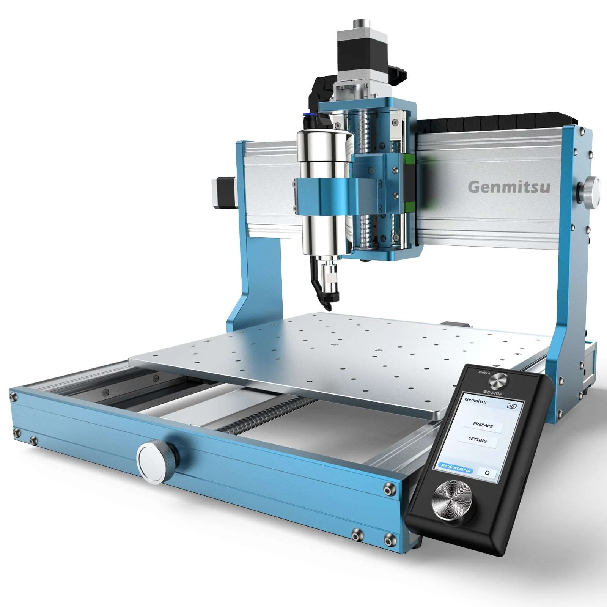

# Overview
This repository is to document information and modifications on the [Genmitsu 3030 PROVer MAX](https://www.sainsmart.com/products/3030-prover-max) Desktop CNC Router.

Each folder contains information and files about a specific topic.

# Contents
1. [Enclosure](./enclosure/readme.md)
2. [Probes](./probes/readme.md)
3. [E-Stops](./estops/readme.md)
4. [Micro PCB](./microPCB/readme.md) for custom probes and E-Stops

## Notes
* All of this information is provided as is and is not intended as a fully detailed guide. 
* No warranty is provided and you use the information at your own risk. 
* If you break your CNC or your cat/dog goes paws up you can not say you were not warned.